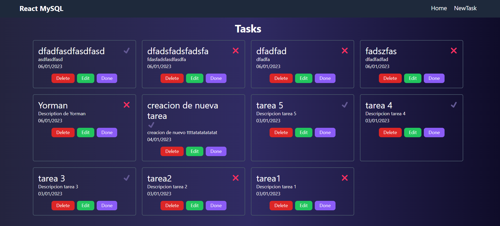
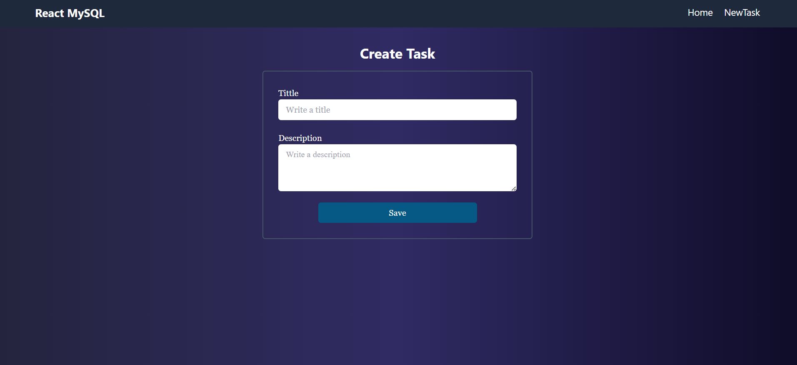

# mern-mysql
Es una aplicación básica de tareas ,que permite crear  

# Backend
Aplicacion con vite, typescript y como base de datos mysql creada y ejecutada en un contenedor
### Tecnologías

- [x] Aplicacion con vite
- [x] TypeScript
- [x] MySql en contenedor
- [x] Node
- [x] pnpm 

## Variables de Entorno
Despues de clonar el proyecto debemos crear un archivo .env  en donde definiremos las siguientes variables de entorno 
- PORT= 4000

# Frontend

### Tecnologías

- [x] Aplicacion con vite
- [x] TypeScript
- [x] React js
- [x] Node
- [x] pnpm 
- [x] Tailwind

# Variables de Entorno
Despues de clonar el proyecto debemos crear un archivo .env  en donde definiremos las siguientes variables de entorno 
- PORT= 4000

 ### Preview

    

    

